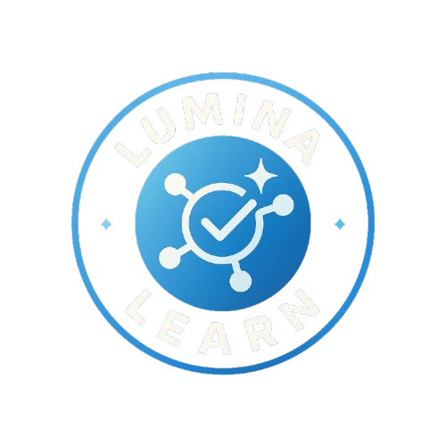
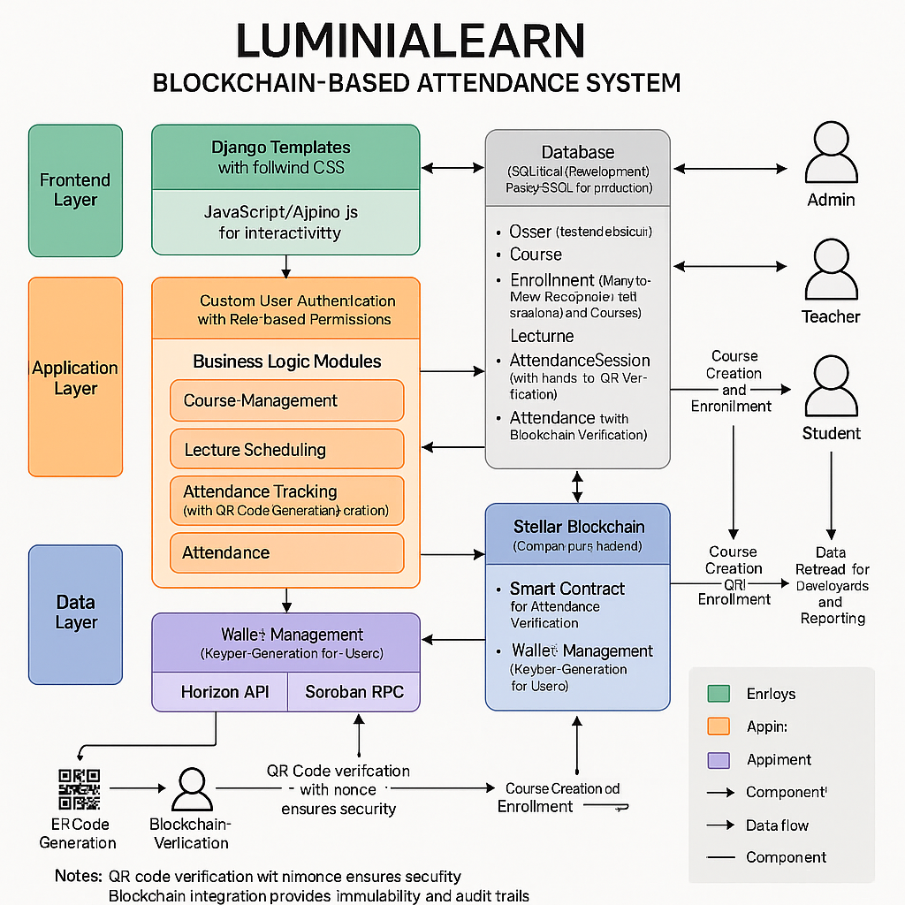

# LuminaLearn: Blockchain-Based Attendance System

<div align="center">
  
  <br>
  <i>Secure, transparent, and efficient attendance management for educational institutions</i>
  <br><br>
</div>

## 📋 Table of Contents

- [Overview](#-overview)
- [Key Features](#-key-features)
- [Technology Stack](#-technology-stack)
- [Architecture](#-architecture)
- [Installation](#-installation)
- [Configuration](#-configuration)
- [Usage Guide](#-usage-guide)
- [API Documentation](#-api-documentation)
- [Blockchain Integration](#-blockchain-integration)
- [Security Considerations](#-security-considerations)
- [Development Roadmap](#-development-roadmap)
- [Contributing](#-contributing)

## 🌟 Overview

LuminaLearn is a modern attendance management system designed for educational institutions that leverages blockchain technology to ensure the integrity and transparency of attendance records. Built on Django and integrated with the Stellar blockchain, the system provides a secure, tamper-proof solution for tracking student attendance in courses and lectures.

The platform supports three user roles (Admin, Teacher, and Student) with role-specific dashboards and features. The core innovation lies in the blockchain integration, which creates an immutable record of attendance that can be independently verified, eliminating disputes and ensuring transparency.

## ✨ Key Features

### User Management
- **Multi-role support**: Admin, Teacher, and Student roles with appropriate permissions
- **Secure authentication**: Custom user model with blockchain wallet integration
- **Profile management**: User profiles with blockchain account details

### Course Management
- **Course creation and scheduling**: Easy setup for teachers
- **Student enrollment**: Simple enrollment process with unique roll numbers
- **Course dashboard**: Overview of enrolled students, lectures, and attendance stats

### Attendance System
- **QR code-based attendance**: Secure, location-based attendance marking
- **Blockchain verification**: Immutable proof of attendance
- **Real-time tracking**: Instant updates to attendance records
- **Manual attendance option**: For exceptional circumstances

### Analytics & Reporting
- **Attendance statistics**: Visual representation of attendance data
- **Course progress tracking**: Monitor attendance trends over time
- **Exportable reports**: Generate and download attendance reports

### Blockchain Features
- **Wallet creation**: Automatic Stellar wallet generation for users
- **Transparent verification**: All attendance records are verifiable on-chain
- **Blockchain explorer integration**: Direct links to view transactions

## 🔧 Technology Stack

### Frontend
- HTML5, CSS3 with Tailwind CSS framework
- JavaScript with Alpine.js for interactivity
- Responsive design optimized for mobile and desktop

### Backend
- Python 3.x
- Django web framework
- Django REST framework for API endpoints

### Database
- SQLite (development)
- PostgreSQL (recommended for production)

### Blockchain
- Stellar blockchain (currently on testnet)
- Stellar SDK for Python
- Soroban smart contracts

### Additional Tools
- QR code generation and scanning (JavaScript)
- Chart.js for data visualization
- Docker for containerization (optional)

## 🏗 Architecture
<div align="center">
  
</div>

LuminaLearn follows a layered architecture with four primary components:

### Frontend Layer
User interface implemented with Django templates, Tailwind CSS, and JavaScript. Provides responsive views for different devices and user roles.

### Application Layer
Core business logic implemented in Django, handling user authentication, course management, attendance tracking, and reporting.

### Data Layer
Django ORM models storing application data, with relationships between users, courses, lectures, and attendance records.

### Blockchain Integration Layer
Integration with Stellar blockchain for secure attendance verification, with wallet management and transaction processing.

For a detailed architecture diagram, see [architecture_diagram.md](architecture_diagram.md).

## 📥 Installation

### Prerequisites
- Python 3.8 or higher
- pip (Python package manager)
- Git
- Virtual environment (recommended)

### Basic Installation

1. Clone the repository:


2. Create and activate a virtual environment:
   ```bash
   python -m venv venv
   source venv/bin/activate  # On Windows, use: venv\Scripts\activate
   ```

3. Install dependencies:
   ```bash
   pip install -r requirements.txt
   ```

4. Set up the database:
   ```bash
   python manage.py migrate
   ```

5. Create a superuser:
   ```bash
   python manage.py createsuperuser
   ```

6. Run the development server:
   ```bash
   python manage.py runserver
   ```

7. Access the application at `http://127.0.0.1:8000/`

### Using Docker (Alternative)

1. Build and run using Docker Compose:
   ```bash
   docker-compose up --build
   ```

2. Access the application at `http://127.0.0.1:8000/`

## ⚙️ Configuration

### Environment Variables

Create a `.env` file in the project root with the following variables:

```
DEBUG=True
SECRET_KEY=your-secret-key
DATABASE_URL=sqlite:///db.sqlite3

# Stellar Blockchain Settings
STELLAR_TESTNET=True
STELLAR_HORIZON_URL=https://horizon-testnet.stellar.org
STELLAR_RPC_URL=https://soroban-testnet.stellar.org
STELLAR_CONTRACT_ID=your-contract-id
```

### Key Configuration Files

- `attendance_system/settings.py`: Main Django settings
- `attendance/stellar_helper.py`: Blockchain integration settings

## 🚀 Usage Guide

### For Administrators

1. **Initial Setup**
   - Access the admin dashboard at `/admin/`
   - Create teacher accounts or approve registrations
   - Monitor system-wide statistics

2. **User Management**
   - Manage teacher and student accounts
   - Reset user passwords if needed
   - View blockchain wallet details

### For Teachers

1. **Course Management**
   - Create new courses from the dashboard
   - Add students to courses
   - Schedule lectures

2. **Attendance Management**
   - Start attendance sessions for lectures
   - Display QR codes for students to scan
   - View and manage attendance records
   - Generate reports

### For Students

1. **Enrollment**
   - Browse available courses
   - Enroll in courses (or wait for teacher enrollment)

2. **Attendance**
   - View scheduled lectures
   - Scan QR codes to mark attendance
   - Check personal attendance statistics
   - View blockchain verification details

## 📝 API Documentation

LuminaLearn offers a set of APIs for potential integration with other systems:

### Authentication Endpoints
- `POST /api/auth/login/`: User login
- `POST /api/auth/logout/`: User logout
- `POST /api/auth/register/`: User registration

### Course Endpoints
- `GET /api/courses/`: List all accessible courses
- `POST /api/courses/`: Create a new course
- `GET /api/courses/{id}/`: Get course details
- `PUT /api/courses/{id}/`: Update course details
- `GET /api/courses/{id}/lectures/`: List course lectures

### Attendance Endpoints
- `GET /api/lectures/{id}/`: Get lecture details
- `POST /api/lectures/{id}/attendance/`: Start attendance session
- `POST /api/attendance/verify/`: Verify attendance
- `GET /api/users/{id}/attendance/`: Get user attendance records

## ⛓ Blockchain Integration

LuminaLearn uses the Stellar blockchain to store immutable attendance records:

### Key Components
- **Stellar Accounts**: Each user gets a Stellar account (keypair)
- **Soroban Contract**: Smart contract for managing attendance records
- **Transactions**: Attendance is recorded as blockchain transactions

### Integration Flow
1. When a user signs up, a Stellar keypair is generated
2. The account is funded on testnet (via Friendbot)
3. When a student marks attendance, a transaction is created
4. Transaction hash is stored in the database as verification

### Verification
- All attendance records can be independently verified on the Stellar blockchain
- The system provides direct links to the Stellar Explorer to view transaction details

## 🔒 Security Considerations

### Data Protection
- User passwords are hashed and never stored in plaintext
- Blockchain private keys should be encrypted in production deployments
- Session management with proper timeout and security

### Blockchain Security
- QR codes contain nonces to prevent replay attacks
- Each attendance session has a limited timeframe 
- Location verification can be enabled (future prospect)

## 📈 Development Roadmap

### Short-term (0-3 months)
- Implement proper factory contracts for courses on the Stellar blockchain
- Enhance smart contract functionality for more robust attendance verification
- Add comprehensive test suite for blockchain interactions
- Improve QR code security with time-based expiration

### Medium-term (3-6 months)
- Transform into a full Learning Management System (LMS)
- Add course content management (lectures, notes, assignments)
- Implement student assessment and grading functionality
- Develop notification system for upcoming lectures and deadlines
- Create dashboards with learning analytics

### Long-term (6+ months)
- Add support for digital credentials and certificates on blockchain
- Implement peer-to-peer learning features
- Develop AI-powered learning recommendations
- Create marketplace for educational content
- Enable cross-institution compatibility and credit transfers

## 👥 Contributing

We welcome contributions to LuminaLearn! Please follow these steps:

1. Fork the repository
2. Create a feature branch (`git checkout -b feature/amazing-feature`)
3. Commit your changes (`git commit -m 'Add some amazing feature'`)
4. Push to the branch (`git push origin feature/amazing-feature`)
5. Open a Pull Request


---

<div align="center">

  <p>Made with ❤️ for education</p>
</div> 