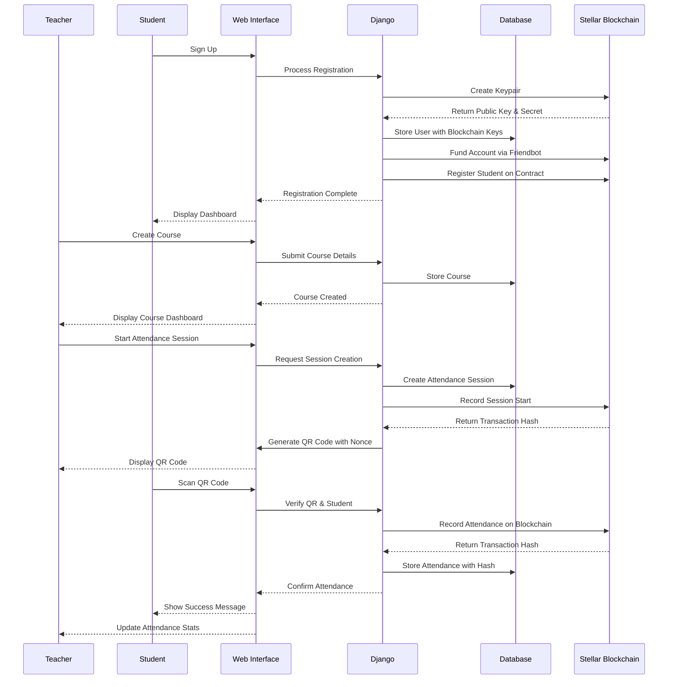

# LuminaLearn System Architecture Diagram

```mermaid
graph TD
    subgraph Frontend["Frontend Layer"]
        UI[Web Interface] --> Templates[Django Templates]
        UI --> JS[JavaScript/Alpine.js]
        UI --> CSS[Tailwind CSS]
    end

    subgraph Application["Application Layer"]
        Django[Django Framework] --> Auth[Authentication System]
        Django --> BL[Business Logic]
        BL --> CourseM[Course Management]
        BL --> LectureM[Lecture Management]
        BL --> AttendanceM[Attendance Tracking]
        BL --> ReportM[Reporting & Analytics]
    end

    subgraph Data["Data Layer"]
        Models[Django Models] --> UserM[User Model]
        Models --> CourseModel[Course]
        Models --> EnrollmentModel[Enrollment]
        Models --> LectureModel[Lecture]
        Models --> SessionModel[AttendanceSession]
        Models --> AttendanceModel[Attendance]
        DB[(Database<br>SQLite/PostgreSQL)] --- Models
    end

    subgraph Blockchain["Blockchain Integration Layer"]
        Stellar[Stellar Blockchain] --> Contract[Smart Contract]
        Stellar --> Wallet[Wallet Management]
        Contract --> AttendanceContract[Attendance Records]
        Horizon[Horizon API] --- Stellar
        Soroban[Soroban RPC] --- Contract
    end

    %% Cross-layer connections
    UI --> Django
    Auth --> UserM
    CourseM --> CourseModel
    LectureM --> LectureModel
    AttendanceM --> SessionModel
    AttendanceM --> AttendanceModel
    AttendanceM --> QR[QR Code Generation]
    QR --> Nonce[Secure Nonce]
    
    %% Blockchain interactions
    BL <--> Blockchain
    AttendanceM --> Contract
    UserM --> Wallet
    
    %% User flows
    subgraph Flows["Key Flows"]
        Register[User Registration]
        CreateCourse[Course Creation]
        MarkAttendance[Attendance Marking]
    end
    
    Register --> Auth
    Register --> Wallet
    CreateCourse --> CourseM
    MarkAttendance --> AttendanceM
    MarkAttendance --> Contract
    
    %% External systems
    Student([Student])
    Teacher([Teacher])
    Admin([Admin])
    
    Student --> UI
    Teacher --> UI
    Admin --> UI
    
    %% Legend
    classDef layer fill:#f9f9f9,stroke:#333,stroke-width:1px;
    classDef component fill:#e1f5fe,stroke:#01579b,stroke-width:1px;
    classDef model fill:#e8f5e9,stroke:#2e7d32,stroke-width:1px;
    classDef blockchain fill:#fff8e1,stroke:#ff8f00,stroke-width:1px;
    classDef actor fill:#f3e5f5,stroke:#6a1b9a,stroke-width:1px,stroke-dasharray: 5 5;
    
    class Frontend,Application,Data,Blockchain layer;
    class UI,Django,Auth,BL,CourseM,LectureM,AttendanceM,ReportM,Horizon,Soroban,QR,Nonce component;
    class Models,UserM,CourseModel,EnrollmentModel,LectureModel,SessionModel,AttendanceModel model;
    class Stellar,Contract,Wallet,AttendanceContract blockchain;
    class Student,Teacher,Admin actor;
```

# Component Interaction Diagram

```mermaid
sequenceDiagram
    participant Teacher
    participant Student
    participant Web as Web Interface
    participant Django
    participant DB as Database
    participant Stellar as Stellar Blockchain
    
    %% User Registration Flow
    Student->>Web: Sign Up
    Web->>Django: Process Registration
    Django->>Stellar: Create Keypair
    Stellar-->>Django: Return Public Key & Secret
    Django->>DB: Store User with Blockchain Keys
    Django->>Stellar: Fund Account via Friendbot
    Django->>Stellar: Register Student on Contract
    Django-->>Web: Registration Complete
    Web-->>Student: Display Dashboard
    
    %% Course Creation Flow
    Teacher->>Web: Create Course
    Web->>Django: Submit Course Details
    Django->>DB: Store Course
    Django-->>Web: Course Created
    Web-->>Teacher: Display Course Dashboard
    
    %% Attendance Flow
    Teacher->>Web: Start Attendance Session
    Web->>Django: Request Session Creation
    Django->>DB: Create Attendance Session
    Django->>Stellar: Record Session Start
    Stellar-->>Django: Return Transaction Hash
    Django->>Web: Generate QR Code with Nonce
    Web-->>Teacher: Display QR Code
    Student->>Web: Scan QR Code
    Web->>Django: Verify QR & Student
    Django->>Stellar: Record Attendance on Blockchain
    Stellar-->>Django: Return Transaction Hash
    Django->>DB: Store Attendance with Hash
    Django-->>Web: Confirm Attendance
    Web-->>Student: Show Success Message
    Web-->>Teacher: Update Attendance Stats
``` 