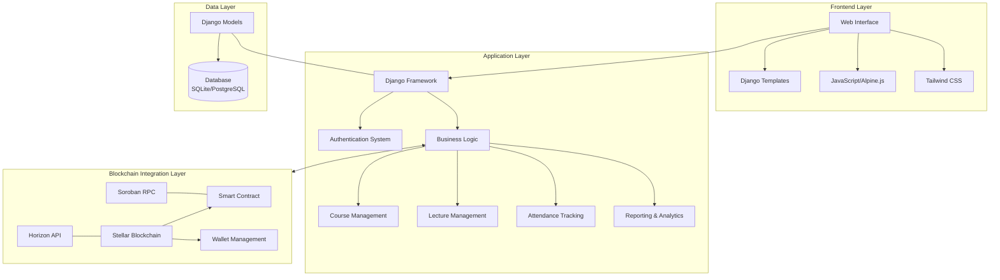
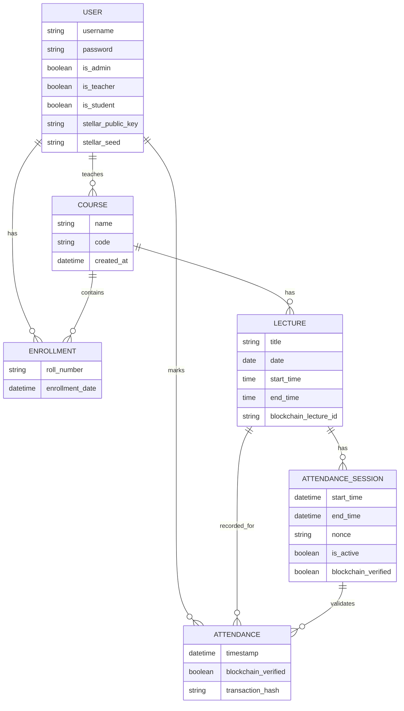
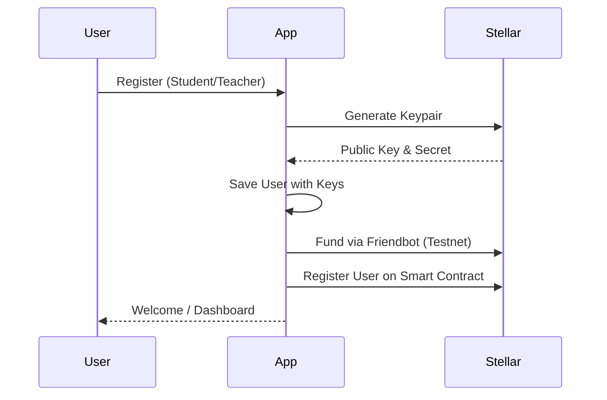
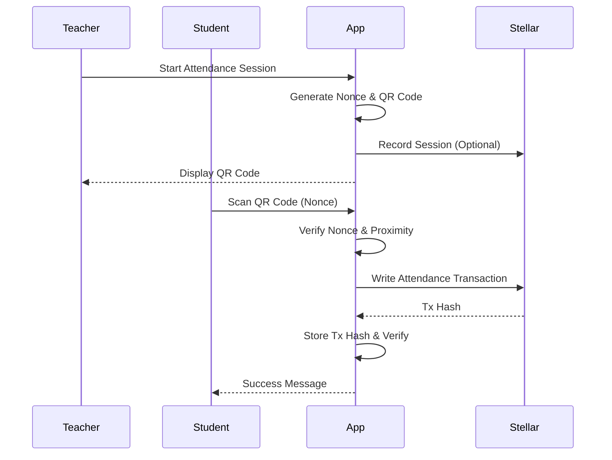

# Architecture Documentation

This document provides a detailed overview of the system design, database schema, and blockchain integration for LuminaLearn.

## System Design Overview

LuminaLearn is built using a layered architecture that separates concerns between the user interface, business logic, data persistence, and blockchain interaction.

## Database Schema

LuminaLearn uses a relational database to store application state. The following entity-relationship diagram illustrates the core models and their relationships.

## API and Logic Flows

### User Registration and Blockchain Onboarding

When a user signs up, the system generates a Stellar account for them to enable blockchain-based verification.

### Attendance Marking Flow

Attendance is marked through a secure QR code system and verified on the Stellar blockchain.

## Blockchain Integration Details

### Stellar SDK and Soroban
LuminaLearn uses the [Stellar Python SDK](https://github.com/StellarCN/py-stellar-sdk) to interact with the Stellar network and Soroban smart contracts.

- **Account Management**: Keys are generated locally. In development, accounts are funded via Friendbot.
- **Smart Contracts**: Written in Rust for the Soroban platform. The contract handles the immutable storage of attendance mappings.
- **Verification**: Each attendance record in the database is linked to a `transaction_hash`, allowing for independent verification on any Stellar explorer.

### Security Note
In production, the `stellar_seed` must be encrypted at rest. Users should ideally manage their own keys via a wallet provider, but the current implementation manages keys on behalf of the user for ease of use in an educational environment.
